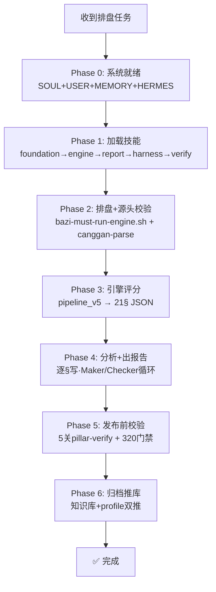

# ═══════════════════════════════════════════════
# 金鉴真人 · 八字排盘平台 HERMES.md
# bazi项目级：约束 · 原则要求 · SOP
# HERMES.md 优先级高于 AGENTS.md（or链第1位）
# ═══════════════════════════════════════════════

## 🔥 项目铁律

### 铁律① — 排盘必须跑引擎（禁止手算）
- 来源: 2026-06-29 梦的日柱算错教训（壬戌→癸亥）
- 强制命令: `bash projects/bazi-platform/scripts/bazi-must-run-engine.sh -n <姓名> -g <性别> -y <年> -m <月> -d <日> -h <时>`
- 验证: 排盘输出必须与https://zydx.top/ 网站输出结果一致，该网站使用POST方式；如果该网站无法使用则必须与engine/paipan.py 计算结果一致，禁止自行计算公式
- 执行时机: **任何八字分析前**，先访问上述zydx.top网站获取引擎数据，网站不可用的情况下再跑这个脚本获取引擎数据

### 铁律② — 知识库路径不依赖记忆
- 人物报告存放: `/root/weiwuji-knowledge-base/07-国学哲学/八字命格/02-人物档案/{序号}-{姓名}/`
- 编码规则: 序号为当前目录最大号+1
- GitHub: `git@github.com:corinwe/weiwuji-knowledge-base.git`
- 推库命令: `cd /root/weiwuji-knowledge-base && git add -A && git commit -m "消息" && git push`
- 技能引用版配置: `skill_view('bazi-platform-harness','references/project-config.md')`

| 铁律③ — 报告必须按标准格式输出（21§）
|- 来源: `skill_view('bazi-report-template')` → bazi-report-template
|- 强制: 每次出报告前先 `skill_view('bazi-report-template')`
|- 格式: 21§板块齐全，§1 25字段四段式，行数800~1000行（不要废话）
|- 禁止自创格式、禁止跳过模板直接输出

### 铁律④ — 排盘源头校验（2026-07-06）
- 排盘脚本 `bazi-must-run-engine.sh` 自动调 `canggan-parse.py`
- 排盘时就标出「藏干十神易混淆项」（如辛+午=七杀⚠️）
- 源头防错，不等分析结束

### 铁律⑤ — 分析结论发布前校验（2026-07-06）
- 跑 `python3 projects/bazi-platform/scripts/pillar-verify.py`
- 5关: 五鼠遁 → 藏干十神 → 结构优先级 → 全局冲刑 → 最优性

### 铁律⑥ — 车库测试门禁（任何修改后必跑）
- 全量验证: `cd projects/bazi-platform/engine/tests && python3 validate_all.py`
- 排盘验证: `bash projects/bazi-platform/scripts/bazi-must-run-engine.sh`

### 铁律⑦ — 原始理论验证原则（2026-07-05 · 学业模块走弯路教训）
- **老板提点 → 先查原始理论验证，不能照单全收**
  - 老板语音输入可能有错字/口水话，需要自行识别
  - 老板提点一个"点"，必须延伸到"面"和"体系"（正反面全看）
- **由点→面→体系**
  - 例：身强遇正财跑引擎认为"喜用"→ 但原始理论说「正财=搞钱」→ 实际是搞钱无心向学，不是学得好
  - 例：身强遇食伤跑引擎认为"喜用"→ 但素材02行129说「食伤追求吃喝玩乐」→ 贪玩
- **每次改规则前加载对应技能文件**确认原始理论
  - `skill_view('bazi-education-analysis')`
  - `skill_view('bazi-marriage-analysis')`
- **每次修改后拿真实案例跑验证**
- **无原始依据不杜撰** — 所有规则必须有素材行号或公众号原文支撑

### 铁律⑧ — 模块审计/修复标准流程（2026-07-05）
**每次审计/修复一个模块，必须按以下标准流程执行：**

**Step 1 — 规则审计（对照原始理论逐条验证）**
  □ 加载对应skill（`skill_view('bazi-xxx-analysis')`）
  □ 逐条对比代码逻辑 vs 原始理论
  □ 无杜撰（原始理论没有的不能写）
  □ 无遗漏（原始理论有的不能少）
  □ 无错误（与原始理论完全一致）
  □ 特别检查：模块的判断逻辑本身是否与九龙道长一致

**Step 2 — 全量更新（修哪改哪的全都要改）**
  □ 代码/引擎逻辑更新
  □ 相关函数签名/返回值更新
  □ 引用该模块的所有文件更新
  □ 页面/报告/脚本/配置同步更新

**Step 3 — 引用链验证（排盘时正确调用）**
  □ 所有pipeline确认调用新版（v3/v4/v5各查一遍）
  □ 调用参数完整（特别是shen_label/喜用神是否传递）
  □ comprehensive_v2中间层参数传递正确
  □ 测试通过（test_full_suite.py）

**Step 4 — 点面体系验证**
  □ 修一个点→延伸到整个面→延伸到整个体系
  □ 正反面逻辑都考虑
  □ 拿真实案例验证输出合理
  □ 确认排盘脚本(bazi-must-run-engine.sh)能正确引用新版

### 铁律⑨ — 有疑问先查原始理论（2026-07-09 · 格局vs身弱依赖关系教训）
- **凡事不确定或者有疑问时，一律先查九龙道长原始理论知识，不靠经验、不靠直觉、不靠猜测**
- **「疑问」包括但不限于：**
  - 某八字现象从未见过 → 查理论再看
  - 两个规则似乎矛盾 → 查理论确认优先级
  - 引擎输出与预期不符 → 查理论验证是否正确
  - 老板提点但与引擎不一致 → 查理论确认谁对
- **查理论的标准流程：**
  1. 先 `skill_view('bazi-foundation-analysis')` 查基础规则
  2. 按事象查对应技能（`bazi-wealth-analysis`/`bazi-career-analysis`等）
  3. 按§索引查具体规则（如§3身强弱、§6格局、§10财富）
  4. 找到原始规则行号 → 对比当前引擎/报告 → 确认是否一致
  5. 有差异 → 修引擎或修报告，以原始理论为准
- **禁止**：凭感觉说"I think"、"应该是"、"大概率"
- **口诀**：有疑先查九龙，不猜不赌不蒙

---

## 📍 核心路径

| 资源 | 路径 |
|:-----|:------|
| 引擎目录 | `projects/bazi-platform/engine/` |
| 排盘门禁脚本 | `projects/bazi-platform/scripts/bazi-must-run-engine.sh` |
| 排盘源头校验 | `projects/bazi-platform/scripts/canggan-parse.py`（自动集成） |
| 四柱5关校验 | `projects/bazi-platform/scripts/pillar-verify.py` |
| 测试验证 | `cd projects/bazi-platform/engine/tests && python3 validate_all.py` |
| 项目配置 | `skill_view('bazi-platform-harness','references/project-config.md')` |
| 知识库 | `/root/weiwuji-knowledge-base` |
| 人物档案 | `/root/weiwuji-knowledge-base/07-国学哲学/八字命格/02-人物档案/{序号}-{姓名}/` |
| skills | `skills/`（配置文件根·Git跟踪中） |

---

## 🔄 工作流程（→ 详见`bazi-paipan-sop`技能 · 已auto_load）



**铁律**：`bazi-paipan-sop` 已加入config.yaml auto_load，每次会话自动加载。执行排盘前确认该技能已就绪。

---

## 📋 任务→技能矩阵

| 任务 | 必须加载 | 可选加载 |
|:-----|:---------|:---------|
| **排盘/基础分析** | `bazi-foundation-analysis` | `bazi-auto-verify` |
| **⛩️ 盲派分析（理法篇）** | `bazi-foundation-analysis §3B-§3K` | `bazi-image-method` |
| **⛩️ 盲派分析（技法篇·三垣/神煞/串宫）** | `bazi-foundation-analysis §3L-§3O` | `bazi-liunian-analysis` |
| **🎨 象法分析（象形读图/取象）** | `bazi-image-method` | `bazi-foundation-analysis §3B` |
| **财富分析** | `bazi-wealth-analysis` | `bazi-foundation-analysis` |
| **事业分析** | `bazi-career-analysis` | `bazi-wealth-analysis` |
| **婚姻分析** | `bazi-marriage-analysis` | `bazi-foundation-analysis` |
| **学业分析** | `bazi-education-analysis` | `bazi-foundation-analysis` |
| **健康/疾病** | `bazi-health-psychology` | `bazi-misfortune-analysis` |
| **子女分析** | `bazi-children-analysis` | `bazi-foundation-analysis` |
| **灾祸分析** | `bazi-misfortune-analysis` | `bazi-liunian-analysis` |
| **化解方法** | `bazi-remission-methods` | `bazi-foundation-analysis` |
| **流年分析** | `bazi-liunian-analysis` | `bazi-foundation-analysis` |
| **买房置业** | `bazi-house-buying` | `bazi-wealth-analysis` |
| **四柱反推** | `bazi-four-pillars-analysis` | — |
| **出报告** | `bazi-report-template` | 对应事象技能 |
| **校准/审计** | `bazi-calibration` | 对应模块技能 |
| **全量验证** | `bazi-validate-all` | `bazi-auto-verify` |

---

|---
|
|## 🚨 老板做事风格标准（焊死·每次加载）
|
|> **每次老板交代任何规则/要求/修改/补充，必须执行三步走，缺一不可：**
|
|```
|第1步 — 写入必加载文件
|  → SOUL.md（系统级·自动加载）或 HERMES.md（项目级·or链加载）
|  → 确保下次会话自动加载，不依赖记忆
|  → ✅ grep确认写入成功
|
|第2步 — 全盘物理审计
|  → 用真实数据/报告验证规则是否真的被执行了
|  → 检查链：引擎代码→技能→SOP→报告输出→验证脚本
|  → ✅ 逐项打勾
|
|第3步 — 审计通过才说OK
|  → 三步全过 → 报告"已完成，已审计"
|  → 任一步没过 → 继续修，不说OK
|
|口诀：写下→审计→说OK，三步少一不算完
|```
|
|**本文件版本：v2.0 · 2026-07-07 · 职责分离重构：SOUL管人格，HERMES管SOP**

---

## 🚨 铁律A — 藏干十神逐字验证（写§1前必须执行）

```
写报告§1排盘表前，必须逐字验证每个地支藏干的十神：
  □ 申藏庚(劫财·本气) 壬(伤官·中气) 戊(正印·余气)
     ❌ 错误: 庚=比肩 | 戊=偏印
     ✅ 正确: 庚=劫财(同五行同阴阳) | 戊=正印(土生金)
  □ 未藏己(偏印·本气) 丁(七杀·中气) 乙(偏财·余气)
  □ 亥藏壬(伤官·本气) 甲(正财·中气)
     ❌ 错误: 壬克辛(金生水=泄不是克)
     ✅ 正确: 辛生壬=泄(我生者·阴阳不同=伤官)
  □ 卯藏乙(偏财·本气)
口诀: 写藏干前先跑引擎验证，不凭记忆写
```

## 🚨 铁律B — 五行生克关系必须准确

```
所有五行生克关系的描述必须精确：
  ✅ 金生水 = 泄（日主辛生水）
  ✅ 水生木 = 生
  ✅ 木生火 = 生
  ❌ 禁止用"克"描述生（"辛克壬"这是错的）
  ❌ 禁止用"生"描述克（"火生辛"这是错的）
口诀: 生生泄克克，先想清楚再下笔
```

## 🚨 铁律C — 报告禁止出现品牌名

```
报告中禁止出现以下字眼：
  ❌ 九龙道长 / 道长老九 / 九龙体系
  ❌ 金鉴真人 / 金鉴体系
  ✅ 直接出结论：如"月令未土藏干己丁乙全不透→杂气格"
  ✅ 规则引用用"原始规则""命理理论""实战规律"
```

## 🚨 铁律D — 婚姻子女重点事件年份表（强制必含·缺了不出）

```
每份报告必须包含婚姻子女重点事件年份表（§16的一部分）：
  格式:
  | 年份 | 事件 | 命理解读 |
  |:----|:-----|:---------|
  | {年} | {婚姻/子女事件} | {解读} |

  包含内容:
  □ 结婚年份（如有）
  □ 配偶星出现的年份
  □ 子女出生年份（如有）
  □ 婚姻危机年份（夫妻宫被冲刑）
  □ 添丁窗口年份

  此表是§16事件总表的核心组成部分，不可省略。
```

## 🚨 铁律E — 规则写入后必须做物理审计

```
每次把规则写入文件后，必须执行物理审计确认：
  第1步: 规则已写入文件? (grep确认)
  第2步: 写一份新报告/重跑引擎验证规则生效?
  第3步: 强制内容在报告中实际存在?(grep关键词)
  第4步: 从输出反推回文件——报告中的每个数据能否追溯到引擎JSON?
口诀: 写进去≠做好了，审计过了才是真
```

## 🚨 铁律F — 引擎数据强制使用（写每§前必须先读JSON）

```
铁律：引擎跑完了，数据就必须用。不用就不要跑。

写报告每§前，强制执行以下步骤（不跳过）：

第1步 — 读JSON
  python3 -c "import json; r=json.load(open('/tmp/{姓名}_engine.json'))
  print(json.dumps(r['sec_X_...'], ensure_ascii=False, indent=2))"

第2步 — 从JSON提取所有需要的数据
  □ 藏干十神 = JSON shi_shen字段（不凭记忆）
  □ 身强弱分数 = JSON score字段（不凭记忆）
  □ 财星分数 = JSON cai_xing_total（不凭记忆）
  □ 大运序列 = JSON da_yun_list（不凭记忆）

第3步 — 只有JSON没有的，才用技能规则补充
第4步 — 报告中的每个数字反向验证：是否能在JSON中找到？

口诀：引擎数据不用，那你跑它干啥？
      每§之前读JSON，从JSON里取十神
      凭记忆写就是错，数据源里取才是真
```

## 🚨 铁律G — 报告先骨架后血肉（防止漏强制项）

```
第1步：先搭骨架（所有§标题+强制项占位符）
  复制模板 → 给每个§建好标题 → 把强制项写成占位符
  □ §16 事件总表（含婚姻子女重点年份）:[占位]

第2步：逐§填入内容（按铁律F从JSON取数）
  每写完一个§ → 在清单上打勾 ✅

第3步：输出前做grep审计
  □ grep '品牌名关键词' → 应为0
  □ grep '强制内容关键词' → 应≥1
  □ grep '报告中的分数' → 应与JSON一致
```
**加载机制：HERMES.md 是 or 链最高优先级，当前无.hermes.md挡路 → 本文件成功加载。**
