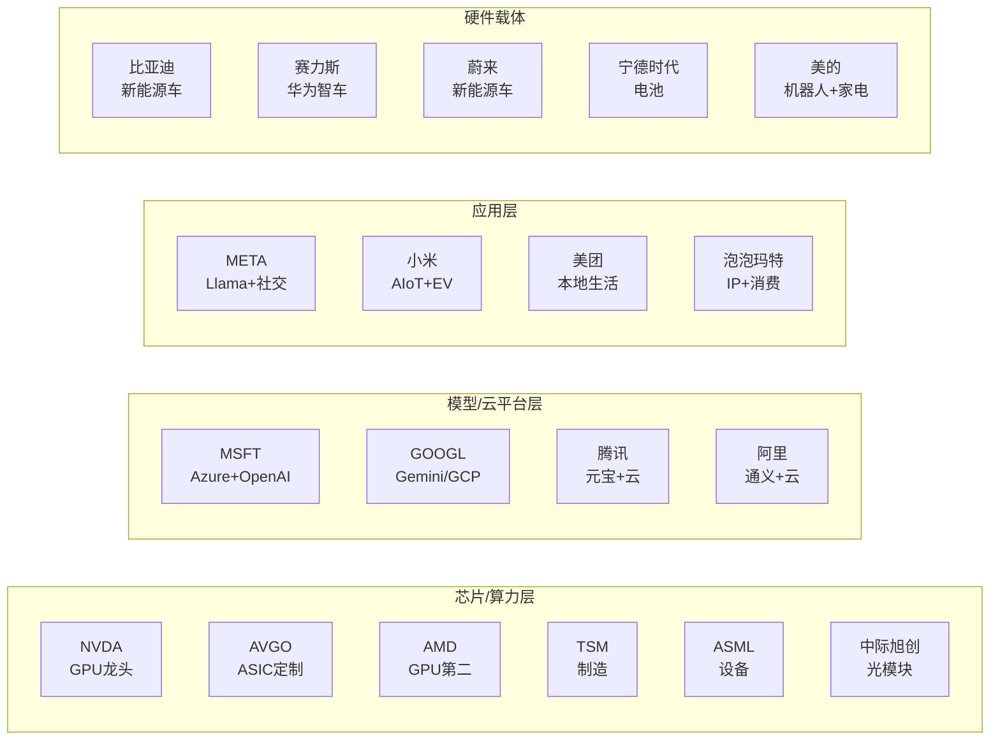

# 全市场标的池三层结构（2026-05-15 新增）

## 一、持仓池（老板现有持仓）

| # | 市场 | 标的 | 代码 | 持仓量 | 成本 | 赛道归属 |
|:-:|:---:|:----|:----:|:-----:|:---:|:--------|
| 1 | 🇭🇰 港股 | 小米集团 | 1810.HK | 1600股 | ~¥40/$47 | 消费电子+EV |
| 2 | 🇭🇰 港股 | 美团 | 3690.HK | 200股 | ~$99 | 本地生活/科技 |
| 3 | 🇭🇰 港股 | 蔚来 | 9866.HK | 200股 | ~$70 | 新能源车 |
| 4 | 🇭🇰 港股 | 阿里巴巴 | 9988.HK | 200股 | ~$177 | 云计算+电商AI |
| 5 | 🇺🇸 美股 | 微软 MSFT | MSFT:NASDAQ | 8股 | ~$501 | AI云/企业软件 |
| 6 | 🇺🇸 美股 | 艺康 ECL | ECL:NYSE | 18股 | ~$255 | 水处理/AI液冷 |
| 7 | 🇨🇳 A股 | 美的集团 | 000333.SZ | 1000股 | ¥69.89 | 家电+机器人 |
| 8 | 🇨🇳 A股 | 比亚迪 | 002594.SZ | 500股 | ¥101.77 | 新能源车+电池 |
| 9 | 🇨🇳 A股 | 300ETF | 510300 | 5500份 | ¥4.571 | 大盘指数 |
| 10 | 🇨🇳 A股 | AI智能ETF | 515070 | 3700份 | ¥1.851 | AI主题ETF |

## 二、行业深度主题日（取代散装轮换 — 2026-05-15老板反馈核心改进）

> ⚠️ **老板反馈**：试运行版"没见增加多少内容和深度洞见"。问题在于将"每日轮换3-5只散装标的"作为核心机制，导致每只都蜻蜓点水。修正方案：每天一个深度主题（200-400字）+ 每周2-3只精选标的（每只200-300字），宁缺毋滥。

### 行业深度主题日

| 星期 | 深度主题 | 对比框架 | 核心问题 |
|:---:|:---------|:---------|:---------|
| 周一 | **AI芯片格局** | NVDA vs AVGO vs AMD | 还有上升空间吗？该怎么选？ |
| 周二 | **AI应用竞赛** | MSFT vs GOOGL vs META vs AMZN | 谁能在AI变现中胜出？ |
| 周三 | **新能源+机器人** | 比亚迪 vs 宁德时代 vs 赛力斯 vs 特斯拉 | 中国电动车产业链哪环最强？ |
| 周四 | **AI基建链** | NVDA→中际旭创→液冷→服务器 | 除了NVDA，供应链上谁最受益？ |
| 周五 | **一周复盘** | 本周涨跌TOP5 + 下周催化剂TOP3 | 本周回顾+下周布局 |

### 每周精选潜力标的（2-3只）

从当周市场焦点中精选2-3只，每只200-300字深度分析，包含：
- **基本面锚：** 估值（PE/PS vs历史/同行）、核心增速、市占率
- **催化剂：** 最近7天最重要事件 + 未来1个月最关键节点
- **狙击逻辑：** 我就是看好/不看好的核心论点（不超过2句话）
- **建仓计划：** 价格区间 + 仓位比例 + 止损位 + 目标价

**选股原则：**
1. 优先选择当前有明确催化剂的（财报、政策、产品发布）
2. 与老板现有持仓形成互补（覆盖AI产业链空白）
3. 如果现有持仓中某只有明确的加仓/减仓信号，也可以作为精选标的来分析

#### 🇺🇸 美股观察池

**1. NVDA（英伟达）** — 芯片/AI算力
- **赛道地位：** AI芯片绝对龙头，全球GPU市占率~80%
- **核心催化剂：** 5/20 FY2026Q1财报（⏳关键），Blackwell Ultra量产，Vera Rubin平台
- **估值参考：** PE~45x（历史中枢），前瞻PE~35x
- **操作逻辑：** 财报前波动加大，可小仓埋伏或等财报后确认

**2. AVGO（博通）** — 定制芯片/网络
- **赛道地位：** 定制AI芯片(ASIC)第二极，网络芯片龙头
- **核心催化剂：** VMware整合完成，AI定制芯片订单（Google TPU、Meta）
- **与NVDA关系：** ASIC相对GPU的补充，受益于AI算力扩散

**3. AMD（超微半导体）** — 芯片
- **赛道地位：** GPU第二，CPU/GPU双线作战
- **核心催化剂：** MI400下一代AI芯片进展，PC市场复苏
- **风险：** 与NVDA差距仍在扩大，执行力是关键

**4. GOOGL（谷歌）** — AI应用/云
- **赛道地位：** 搜索引擎+云计算+AI大模型（Gemini/Gemma）
- **核心催化剂：** Gemini 2.5 Pro多模态能力，AI搜索渗透率提升
- **注意：** 搜索业务受AI竞争扰动，云业务高速增长

#### 🇭🇰 港股观察池

**5. 腾讯 0700.HK** — AI应用/社交
- **赛道地位：** 中国互联网龙头，社交+游戏+云
- **核心催化剂：** 元宝AI进展，微信生态变现深化
- **与阿里对比：** 各有侧重（社交vs电商），腾讯资本配置更稳定

**6. 泡泡玛特 9992.HK** — 消费科技/IP经济
- **赛道地位：** 潮玩IP龙头，出海增长迅猛
- **核心催化剂：** 海外收入占比提升（东南亚+欧美），LABUBU全球爆款
- **注意：** 估值已较高，等待回调机会

#### 🇨🇳 A股观察池

**7. 宁德时代 300750.SZ** — 新能源电池
- **赛道地位：** 全球动力电池龙头，市占率~37%
- **核心催化剂：** 固态电池进展（2027量产计划），储能业务爆发
- **与比亚迪关系：** 比亚迪自供电池+整车，宁王专注电池+储能

**8. 中际旭创 300308.SZ** — 光模块/AI算力
- **赛道地位：** 全球光模块龙头，AI数据中心核心供应商
- **核心催化剂：** 800G/1.6T光模块放量，英伟达供应链
- **注意：** 估值弹性大，受AI资本开支周期影响

**9. 赛力斯 601127.SH** — 华为智车/新能源
- **赛道地位：** 华为智选车模式最佳伙伴，问界系列
- **核心催化剂：** M9/M8交付放量，华为智驾持续升级
- **与比亚迪关系：** 互补（增程vs纯电），都在新能源赛道

## 三、雷达池（每日1行简述）

### 🇺🇸 美股雷达
| 标的 | 代码 | 赛道 | 关键词 |
|:----|:----:|:----|:-------|
| 英伟达 | NVDA:NASDAQ | AI芯片 | 财报5/20⏳，Blackwell，Vera Rubin |
| 博通 | AVGO:NASDAQ | AI芯片(ASIC) | VMware，定制芯片 |
| AMD | AMD:NASDAQ | AI芯片 | MI400，PC复苏 |
| 谷歌 | GOOGL:NASDAQ | AI应用 | Gemini，AI搜索 |
| Meta | META:NASDAQ | AI应用 | Llama，社交广告 |
| 特斯拉 | TSLA:NASDAQ | 新能源车 | FSD，Robotaxi |
| 台积电 | TSM:NYSE | 芯片制造 | 先进封装，3nm/2nm |
| ASML | ASML:NASDAQ | 芯片设备 | EUV光刻机，出口管制 |

### 🇭🇰 港股雷达
| 标的 | 代码 | 赛道 | 关键词 |
|:----|:----:|:----|:-------|
| 腾讯 | 0700.HK | AI应用/社交 | 元宝，游戏版号 |
| 中芯国际 | 0981.HK | 芯片制造 | 国产替代，先进制程 |
| 泡泡玛特 | 9992.HK | 消费科技/IP | 出海，LABUBU |
| 小鹏 | 9868.HK | 新能源车 | MONA，智驾 |

### 🇨🇳 A股雷达
| 标的 | 代码 | 赛道 | 关键词 |
|:----|:----:|:----|:-------|
| 中际旭创 | 300308.SZ | 光模块/AI | 800G/1.6T，英伟达链 |
| 宁德时代 | 300750.SZ | 新能源电池 | 固态电池，储能 |
| 赛力斯 | 601127.SH | 华为智车 | 问界M9，智驾 |
| 工业富联 | 601138.SH | AI服务器 | 英伟达代工，液冷 |

## 四、AI全产业链覆盖检查

**覆盖状态：**
- ✅ **芯片层：** NVDA(龙一) + AVGO(ASIC) + AMD(龙二) + 中际旭创(光模块) = **强覆盖**
- ✅ **云/模型层：** MSFT(OpenAI) + GOOGL(Gemini) + 阿里(通义) + 腾讯(元宝) = **完整覆盖**
- ✅ **应用层：** META(Llama) + 小米(AIoT+EV) + 美团(本地) + 泡泡玛特(IP) = **多元覆盖**
- ✅ **硬件载体：** 比亚迪(新能源龙头) + 赛力斯(华为智车) + 宁德时代(电池龙头) + 美的(机器人) = **完整覆盖**
- ⚠️ **缺口：** 没有覆盖SaaS/企业软件赛道，如果老板感兴趣可加入CRM(Salesforce)/WDAY(Workday)
